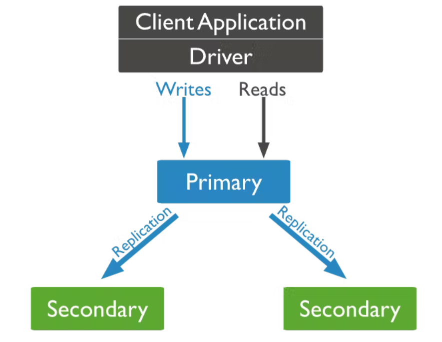
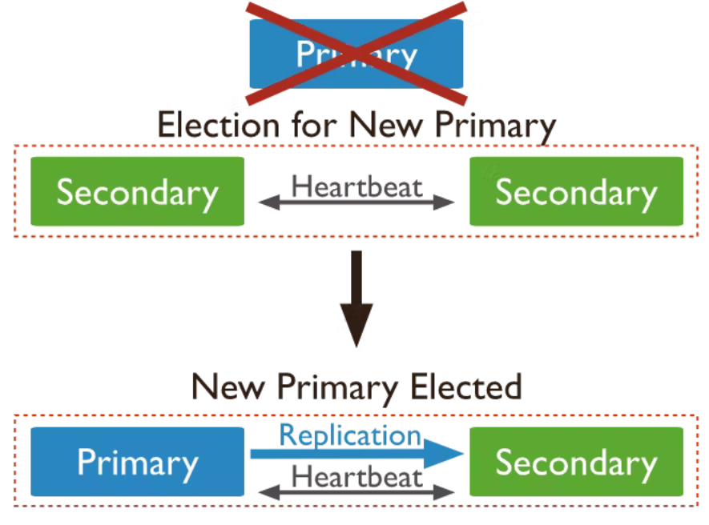

= MongoDB 🤝 Panache
Polleichtner Moritz
1.0, 2022-02-10
ifndef::sourcedir[:sourcedir: ../src/main/java]
ifndef::imagesdir[:imagesdir: images]
ifndef::backend[:backend: html5]
:icons: font

== MongoDB

* Open-Source
* NoSQL
* Dokumentenorientiert

== MongoDB Cluster

* Replica Set
* Sharded Cluster

=== Sharded Cluster

* Datensätze werden auf Instanzen aufgeteilt
* Ein Shard kann auch ein Replica Set sein

==== Aufbau

image::images/sc.png[cluster]

=== Replica Set

* Kopie mehrerer MongoDB server instanzen
* Hohe Verfügbarkeit und Redundanz

==== Aufbau

==== Aufbau

